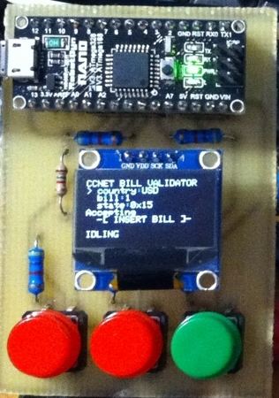

# FakeCnD
Cashboxes and Dispensers emulators on arduino

  

This is simple project for cash terminals developers.
Simple change settings of emulator in config.h, and upload sketch to yours arduino.
Connect arduino to PC and start testing.

Available emulators:
Puloon LCDM 2000
Generic ccnet bill validator
